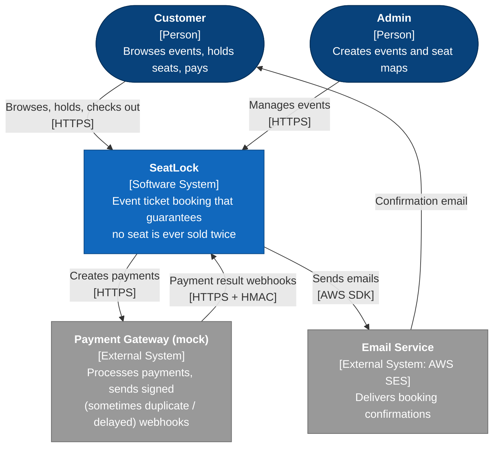
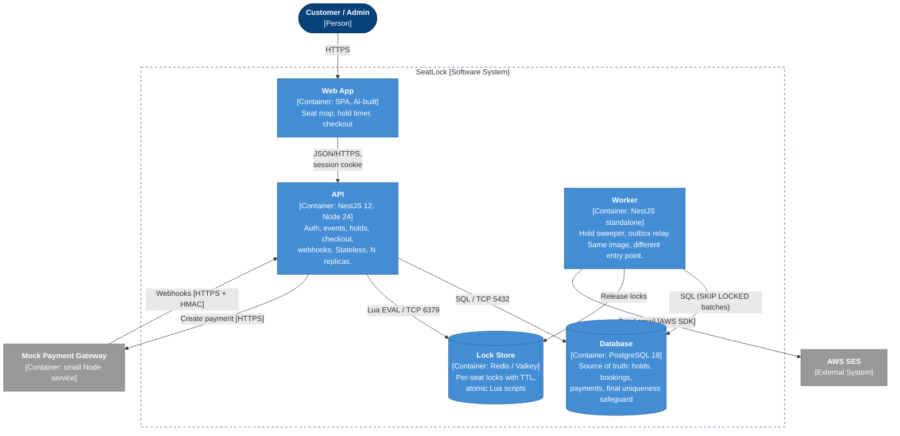
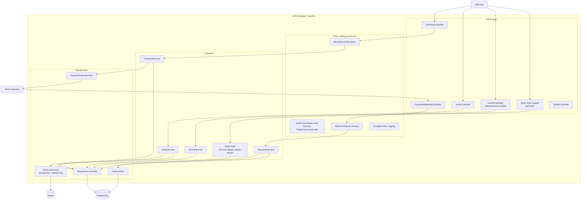
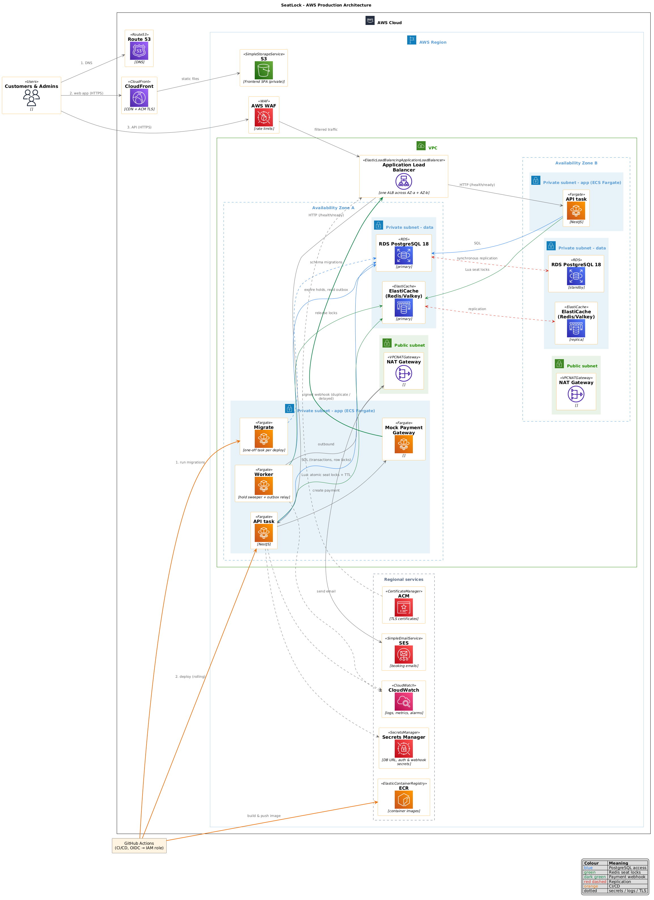
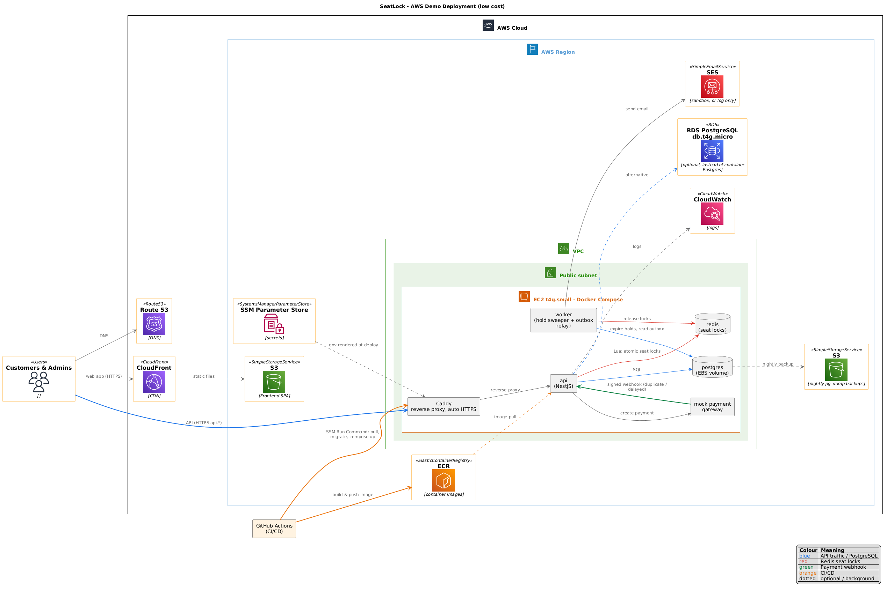
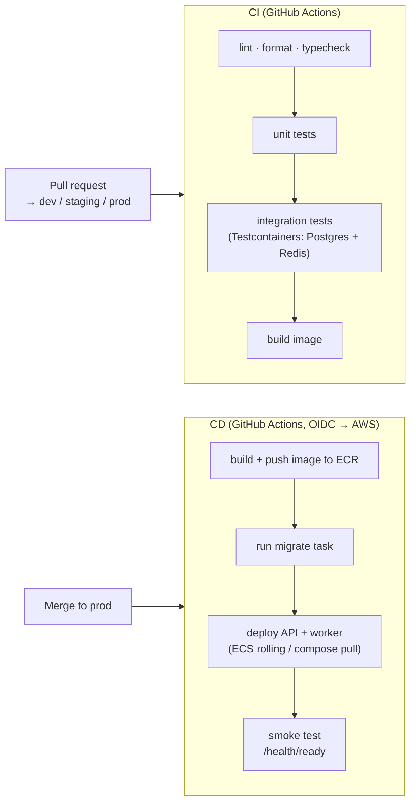

# SeatLock: Architecture

| | |
| --- | --- |
| **Status** | Draft v0.1, open for discussion |
| **Last updated** | 2026-10-06 |
| **Related** | [System design](system-design.md) · [Plan](plan.md) · [ADRs](adr/) |

This document describes **how SeatLock is structured and deployed**, using the [C4 model](https://c4model.com) (context → containers → components) plus AWS deployment diagrams. *Why* the system behaves as it does (flows, concurrency, schema) is in the [system design](system-design.md).

There are two deployments:

| | [Production target](#4-aws-production-target) | [Demo deployment](#5-aws-demo-deployment-low-cost) |
| --- | --- | --- |
| Purpose | The design you'd run for real traffic, and discuss in interviews | What actually runs live for the portfolio |
| Shape | ECS Fargate, ALB, RDS Multi-AZ, ElastiCache, private subnets | One EC2 instance running Docker Compose, with S3 + CloudFront for the frontend |
| Cost (rough, region-dependent) | ~$120–200 / month | ~$5–15 / month |

---

## 1. C4 Level 1: System context

Who uses SeatLock and what it talks to.

## 2. C4 Level 2: Containers

The deployable units inside SeatLock.

| Container | Tech | Scales | State |
| --- | --- | --- | --- |
| Web App | SPA (AI-built), static files | CDN | none |
| API | NestJS, Express | Horizontally (N tasks) | none, by design |
| Worker | NestJS standalone app context | 1+ tasks (safe as N thanks to `SKIP LOCKED`) | none |
| Mock Gateway | Small Node HTTP service | 1 task | in-memory (it's a mock) |
| PostgreSQL | RDS / container | Vertical, plus read replica later | **authoritative** |
| Redis | ElastiCache / container | Primary + replica | ephemeral (locks only) |

## 3. C4 Level 3: Components (API container)

Module rules follow the project conventions: controllers handle HTTP only, services hold business rules, repositories hold queries, and modules talk to each other only through exported services.

## 4. AWS production target

### Request path, end to end

1. **Route 53** resolves `seatlock.example.com` (frontend) and `api.seatlock.example.com` (API).
2. The **frontend** is served from a private **S3** bucket through **CloudFront** (Origin Access Control, ACM certificate).
3. **API calls** go to an **Application Load Balancer** in public subnets across 2 AZs. It terminates TLS with **ACM** and is protected by **AWS WAF** (rate limiting, especially on `/holds` and `/auth`).
4. The ALB forwards to the **ECS Fargate API service**: 2+ tasks in **private subnets**, one per AZ, with auto scaling on CPU and request count. The ALB target health check is `/health/ready`, and container health is `/health`.
5. API tasks talk to:
   - **RDS PostgreSQL** (Multi-AZ, private subnet, encrypted, automated backups, PITR);
   - **ElastiCache for Redis/Valkey** (primary + replica, Multi-AZ, in-transit encryption plus AUTH).
6. **Payment flow:** the API calls the **mock gateway** (an ECS service reached internally via **Cloud Map** service discovery). The gateway sends webhooks back through the ALB to `/webhooks/payments`, signed with HMAC.
7. The **worker service** (ECS Fargate, 1+ tasks) runs the hold sweeper and outbox relay, and sends emails through **Amazon SES**.
8. **Migrations** run as a one-off **ECS task** (`node dist/database/migrate.js`) in the deploy pipeline, before the API service updates.

### Supporting services

| Concern | Service |
| --- | --- |
| Container images | **ECR** (scan on push) |
| Secrets (`DATABASE_URL`, `BETTER_AUTH_SECRET`, webhook secret, Redis auth) | **Secrets Manager**, injected into task definitions |
| Logs | **CloudWatch Logs** (structured JSON) |
| Metrics and alarms | **CloudWatch** metrics + alarms (5xx rate, p95 latency, hold conflict rate, DB connections, Redis memory) |
| Tracing (stretch) | AWS X-Ray / OpenTelemetry |
| Outbound internet from private subnets | **NAT Gateway** (or VPC endpoints for ECR, Secrets Manager, CloudWatch, SES to cut NAT cost) |
| Infrastructure as code (proposed) | Terraform or AWS CDK |

### Network layout

| Subnet tier | Contents | Inbound allowed from |
| --- | --- | --- |
| Public (2 AZs) | ALB, NAT Gateway | Internet (443 only) |
| Private app (2 AZs) | ECS tasks (API, worker, gateway) | ALB security group only |
| Private data (2 AZs) | RDS, ElastiCache | App security group only (5432, 6379) |

## 5. AWS demo deployment (low cost)

The **same Docker image** and the **same Compose file pattern** as local development run on a single instance:

| Piece | Choice | Notes |
| --- | --- | --- |
| Compute | 1 × **EC2** `t4g.small` (ARM, Graviton) in a public subnet | Runs `docker compose`: Caddy, API, worker, mock gateway, Redis, and optionally Postgres |
| TLS / reverse proxy | **Caddy** container | Automatic Let's Encrypt certificates, no ALB cost |
| Database | Postgres container with an EBS volume and nightly `pg_dump` to S3, **or** RDS `db.t4g.micro` | The container is cheapest. RDS gives managed backups. **Open decision.** |
| Redis | Redis container | Fine for a demo. Loss only affects in-flight holds (by design). |
| Frontend | **S3 + CloudFront** | Effectively free at demo traffic |
| Email | **SES** (sandbox: verified recipients only) or log | |
| Secrets | **SSM Parameter Store** (free tier) → rendered into `.env` at deploy | |
| Deploy | GitHub Actions → image to **ECR** → SSH / **SSM Run Command** `docker compose pull && up -d` | Migration container runs first (the `migrate` service already exists in compose) |
| DNS | Route 53 or a free subdomain | |

**What the demo gives up compared with production:** no Multi-AZ or auto scaling, a single point of failure, and the database on the same host (if that option is chosen). All of this is documented as a known limitation. The *application* design is identical, so correctness claims and load tests still hold for that instance size.

## 6. CI/CD

- **Branches → environments:** `dev` and `staging` run CI only for now. `prod` deploys to the demo deployment. A staging environment is a later option.
- **AWS auth:** GitHub OIDC → IAM role. No long-lived AWS keys in GitHub secrets.
- **Migrations are forward-only** and run before the new code. Breaking schema changes use expand → migrate → contract across releases.

## 7. Cross-cutting concerns

### Security

- Authentication is delegated to **Better Auth**: email + password, password hashing, DB-backed sessions in an HTTP-only cookie, CSRF protection via trusted origins. The SPA (`seatlock.example.com`) and API (`api.seatlock.example.com`) share the cookie through Better Auth's cross-subdomain cookie setting, with CORS `credentials: true`.
- Roles come from the Better Auth **admin plugin** (`user.role`). A `RolesGuard` protects `/admin/*`. Every hold, booking or checkout is checked for ownership.
- Webhooks are verified with an **HMAC-SHA256** signature plus a timestamp, to prevent replays.
- **Rate limiting:** `@nestjs/throttler` in the app, plus WAF rate rules in production.
- No secrets in images or in the repo. Config is validated at startup (zod).
- `/docs` is disabled in production.

### Observability

- **Structured JSON logs** (pino) with a request ID, user ID and hold or booking IDs.
- **Domain metrics:** holds attempted / succeeded / conflicted, holds expired by the sweeper, webhook duplicates, late payments, unique-violation saves (should be **0** in normal operation; non-zero means an earlier layer failed).
- **Health:** `/health` (liveness) and `/health/ready` (DB readiness).

### Scalability notes

- The API is stateless, so it scales horizontally. The **hot path for one popular event is one Redis slot** (hash tag per event), which is the intended trade-off for multi-key atomicity.
- **Postgres connection budget:** tasks × `DB_POOL_MAX` must stay under the RDS `max_connections`. Use RDS Proxy if the task count grows.
- **Seat map reads** can move to a read replica or a short-TTL cache once measurements justify it.
