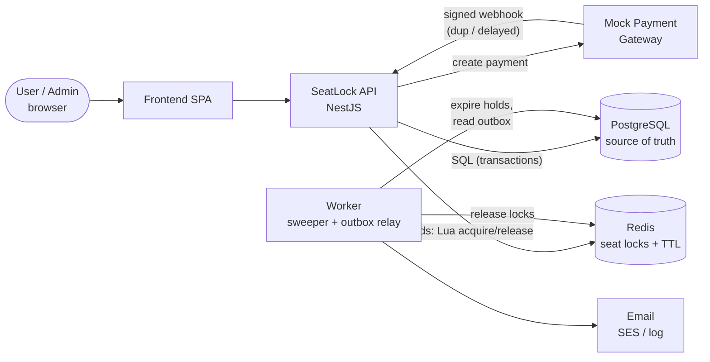
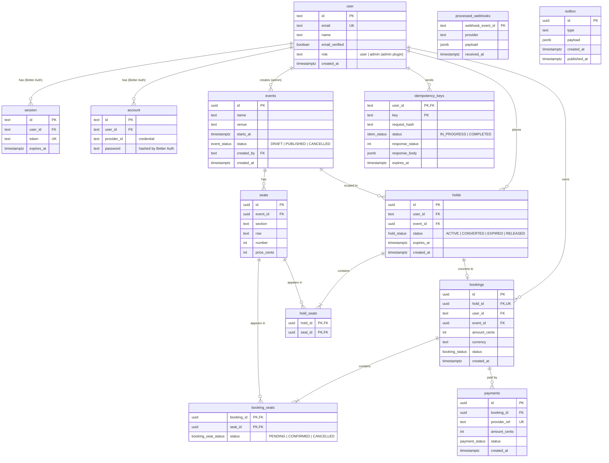
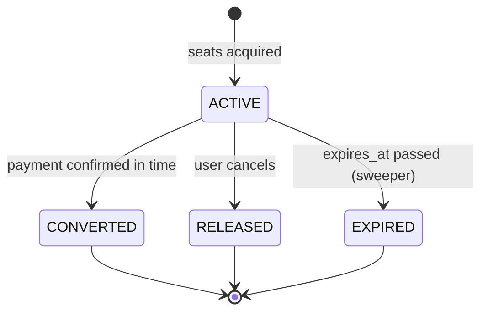
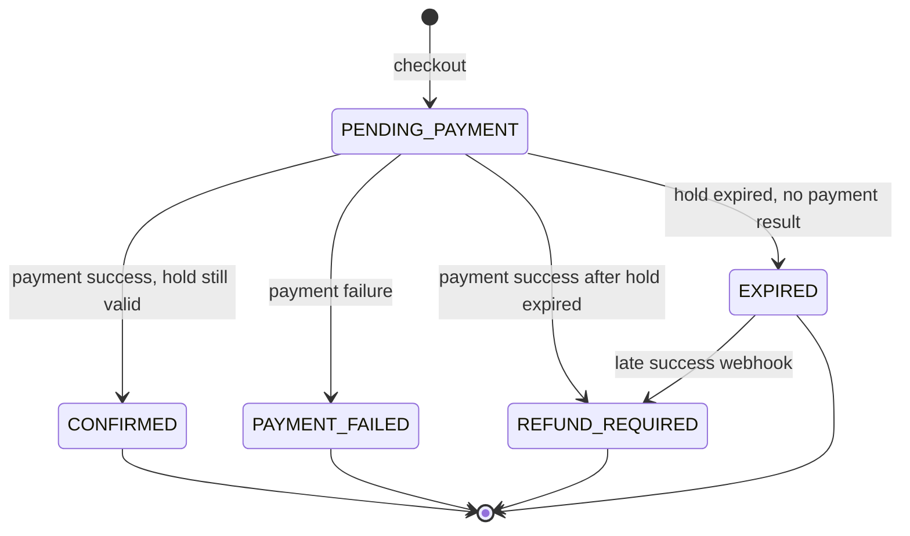
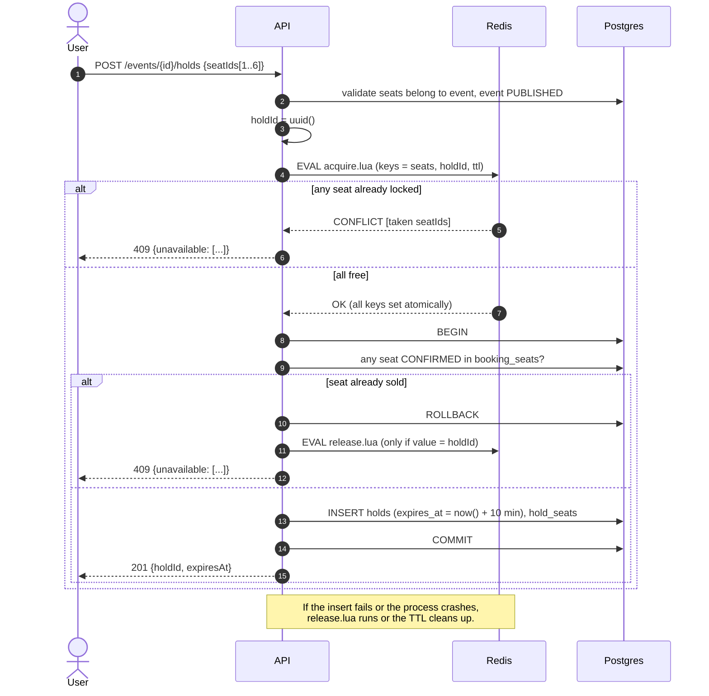
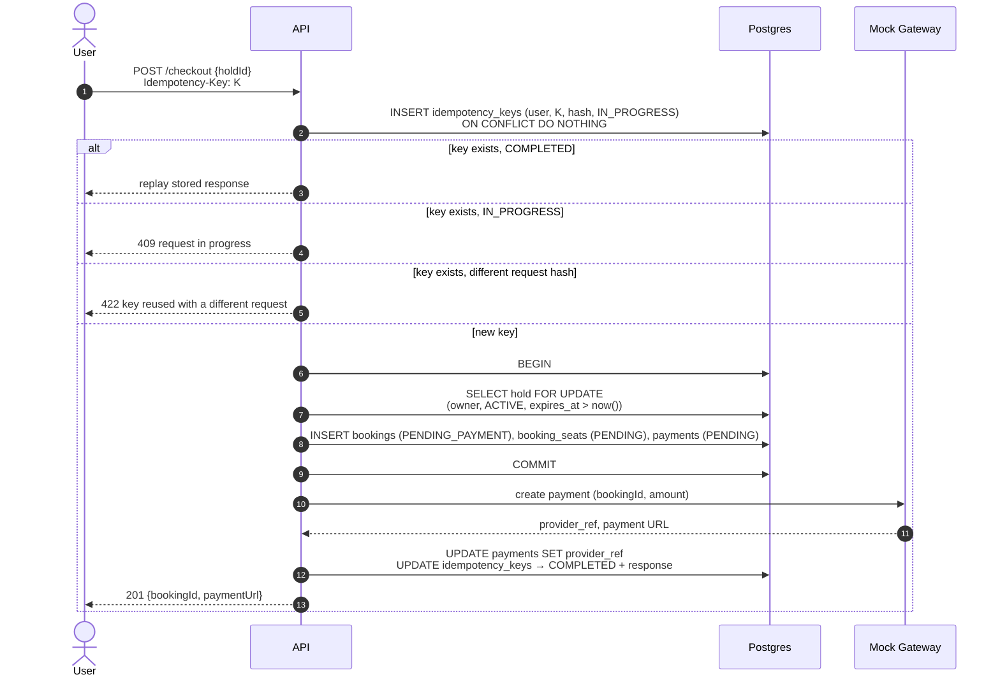
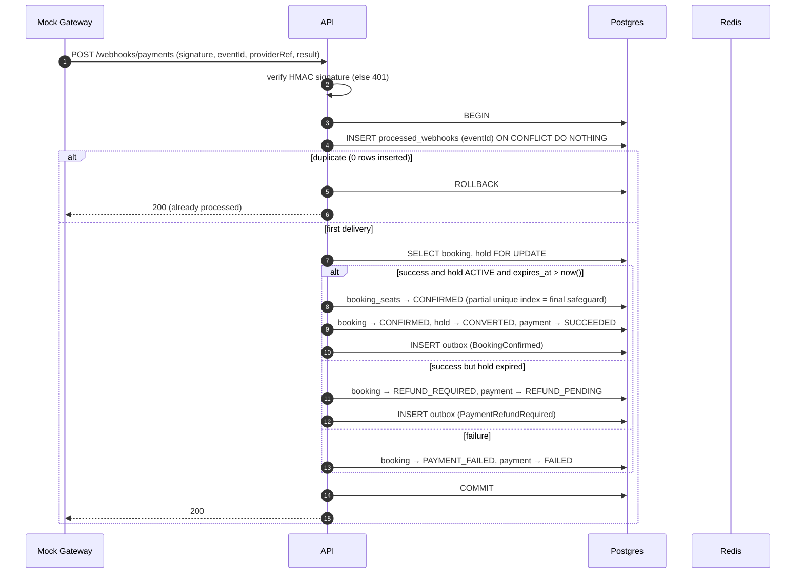
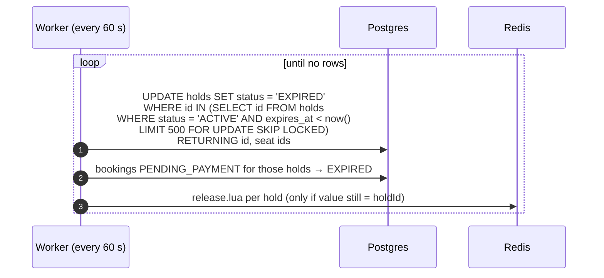

# SeatLock: System Design

| | |
| --- | --- |
| **Status** | Draft v0.1, open for discussion |
| **Owner** | Ashutosh Khairnar |
| **Last updated** | 2026-10-06 |
| **Related** | [Architecture](architecture.md) · [Plan](plan.md) · [ADRs](adr/) |

> Everything marked **Proposed** is a recommendation that hasn't been agreed yet. Open questions are collected in [§12](#12-open-questions).

---

## Contents

1. [Problem](#1-problem)
2. [Goals and non-goals](#2-goals-and-non-goals)
3. [Requirements](#3-requirements)
4. [Tech stack](#4-tech-stack)
5. [High-level design](#5-high-level-design)
6. [Data model](#6-data-model)
7. [Core flows](#7-core-flows)
8. [Concurrency and consistency strategy](#8-concurrency-and-consistency-strategy)
9. [Failure modes and policies](#9-failure-modes-and-policies)
10. [API overview](#10-api-overview)
11. [Limitations and trade-offs](#11-limitations-and-trade-offs)
12. [Open questions](#12-open-questions)

---

## 1. Problem

A popular event goes on sale. Hundreds of users open the seat map at the same moment and click the **same seat**. A naive implementation ("check if free, then save") lets two of them succeed, because both checks run before either save. The venue then has two tickets for one seat.

The same class of bug shows up throughout checkout:

| Scenario | What goes wrong naively |
| --- | --- |
| Two users click seat A4 at the same moment | Both get it: **double booking** |
| A user selects A3, A4, A5 but A4 is taken | A3 and A5 end up held, leaving a broken, partial selection |
| The user's network drops and the app retries "Pay" | Two bookings and **two charges** |
| The payment provider sends the same webhook twice | The booking is confirmed twice and the notification goes out twice |
| A payment succeeds after the 10-minute hold has expired | The seat may already belong to someone else |
| Redis restarts or is unreachable | Locks are lost and seats are silently up for grabs |

**SeatLock's purpose is to prove that none of these can happen.** The proof comes from the design, from tests against real Postgres and Redis, and from load tests (k6) that show exactly one confirmed booking per seat under heavy contention.

## 2. Goals and non-goals

### Goals

- **G1. No double booking.** A seat is confirmed for at most one booking, guaranteed by the database even if every other layer fails.
- **G2. All-or-nothing holds.** A request for 1–6 seats either holds all of them or none.
- **G3. Seat holds expire on time.** Unpaid holds are released automatically after 10 minutes.
- **G4. Idempotent checkout.** Retrying a checkout with the same `Idempotency-Key` never creates a second booking or charge.
- **G5. Exactly-once effect for webhooks.** Duplicate, delayed or out-of-order webhooks don't corrupt state.
- **G6. Measured evidence.** Load test results are published in the repo.

### Non-goals (v1)

- A real payment provider (a mock gateway simulates one, including its failure modes)
- Real money movement and real refunds (refunds are recorded as `REFUND_PENDING` for manual or mock processing)
- Seat-map rendering sophistication, venue layout editors and dynamic pricing
- Multi-region deployment
- Live seat updates over WebSockets and a virtual waiting room. **Stretch goals.**

## 3. Requirements

### Functional

| ID | Requirement |
| --- | --- |
| F1 | Users sign up and sign in with email + password via **Better Auth** (session cookie). Roles: `user`, `admin` (Better Auth admin plugin). |
| F2 | Admins create events and generate seats (sections, rows, numbers, prices). |
| F3 | Anyone can list events and see a seat map with each seat's status: `AVAILABLE`, `HELD` or `SOLD`. |
| F4 | A user holds 1–6 seats of one event for 10 minutes, atomically. |
| F5 | A user can release their own hold early. |
| F6 | A user checks out a hold with an `Idempotency-Key` header, which creates a booking and a payment. |
| F7 | The mock gateway reports the payment result via a signed webhook, sometimes duplicated or delayed. |
| F8 | A successful payment within the hold window confirms the booking. A late payment is rejected and marked for refund. |
| F9 | The user receives a confirmation notification (email via SES, or a log line locally). |
| F10 | A user can view their own bookings. |

### Non-functional

| ID | Requirement | Target (to validate in load tests) |
| --- | --- | --- |
| N1 | Correctness under contention | 0 double bookings at 500+ concurrent requests on one seat |
| N2 | Hold latency | p95 < 150 ms under load (to be measured) |
| N3 | Seat map read latency | p95 < 100 ms (to be measured) |
| N4 | Availability | API keeps serving reads and payments when Redis is down. New holds fail closed (§9). |
| N5 | Stateless app tier | Any number of API instances. No in-memory state. |
| N6 | Observability | Structured logs and metrics for hold success, conflicts, expiries and webhook duplicates |
| N7 | Security | Auth delegated to Better Auth (hashed passwords, DB-backed sessions, CSRF protection), HMAC-signed webhooks, secrets in a secrets manager |

## 4. Tech stack

| Layer | Choice | Why |
| --- | --- | --- |
| Language / framework | TypeScript 6, NestJS 12 (ESM) | Strong typing, modular DI, testability |
| Database | PostgreSQL 18 | Transactions, row locks, **partial unique indexes** (the final safeguard against double booking) |
| ORM / migrations | Drizzle ORM + drizzle-kit | SQL-first, typed `FOR UPDATE` / `SKIP LOCKED`, reviewable SQL migrations ([why not Prisma/TypeORM](adr/0001-drizzle-orm.md)) |
| Locks / cache | Redis 7 (ElastiCache / Valkey in prod) | Atomic Lua scripts, per-key TTL, sub-millisecond ops ([ADR 0002](adr/0002-redis-lua-seat-holds.md)) |
| Background work | Separate worker process (same codebase) | Sweeper and outbox relay. Safe to run as N copies thanks to `SKIP LOCKED`. |
| Notifications | Transactional outbox → worker → SES (log locally) | A notification can't be lost even if sending fails ([§8.5](#85-transactional-outbox-for-notifications)) |
| Validation | zod (+ `nestjs-zod` for DTOs, **proposed**) | One schema for validation, types and OpenAPI |
| Auth | [Better Auth](https://www.better-auth.com) (email + password, admin plugin for roles, Drizzle adapter) + `@thallesp/nestjs-better-auth` | Proven library instead of hand-rolled auth. Auth isn't what this project is meant to show. |
| API docs | `@nestjs/swagger` + Scalar | Spec generated from code |
| Testing | Vitest, Supertest, Testcontainers (Postgres, Redis), k6 | Real dependencies in integration tests, and load tests as proof |
| Infra (local) | Docker Compose | One-command environment |
| Infra (cloud) | AWS: see [Architecture](architecture.md) | Production target design plus a low-cost demo deployment |
| CI/CD | GitHub Actions | Tests on every push, image build and deploy |

## 5. High-level design

**Responsibilities:**

- **PostgreSQL is the source of truth** for everything: holds, bookings, payments, and the final seat ownership guarantee.
- **Redis is a fast gatekeeper** for *contended* writes. It decides quickly and atomically who gets a seat during a hold attempt. Losing Redis data must never cause a double booking, only a temporary inability to create new holds.
- **API** handles HTTP, auth, validation and orchestration.
- **Worker** handles time-based and asynchronous work (hold expiry, notifications). It shares the codebase but runs from a separate entry point.
- **Mock gateway** is a separate small service that behaves like a real payment provider, including the bad behaviour (duplicate and delayed webhooks).

## 6. Data model

### 6.1 Entity relationship diagram

### 6.2 Tables

| Table | Owner module | Purpose | Key constraints and indexes |
| --- | --- | --- | --- |
| `user`, `session`, `account`, `verification` | auth (**generated by Better Auth**) | Accounts, sessions, credentials, verification tokens | Schema generated with the Better Auth CLI into Drizzle. Don't hand-edit; regenerate on upgrades. |
| `events` | events | Bookable events | index `(status, starts_at)` for listing |
| `seats` | events | Seat inventory per event | **unique `(event_id, section, row, number)`**, index `event_id`, check `price_cents >= 0` |
| `holds` | holds | One 10-minute reservation | index `(status, expires_at)` for the sweeper, index `(user_id, event_id)` |
| `hold_seats` | holds | Seats in a hold | PK `(hold_id, seat_id)`, index `seat_id` |
| `bookings` | bookings | Checkout record | **unique `hold_id`** (one booking per hold), index `user_id` |
| `booking_seats` | bookings | Seats in a booking | PK `(booking_id, seat_id)`, **partial unique index `(seat_id) WHERE status = 'CONFIRMED'`** |
| `payments` | payments | Payment attempts | **unique `provider_ref`**, index `booking_id` |
| `processed_webhooks` | payments | Webhook deduplication | PK `webhook_event_id` |
| `idempotency_keys` | common | Saved checkout responses | PK `(user_id, key)`, index `expires_at` for cleanup |
| `outbox` | common | Pending side effects (notifications) | partial index `(created_at) WHERE published_at IS NULL` |

### 6.3 Changes from the original plan, and why

| Original | Proposed | Reason |
| --- | --- | --- |
| `holds.seat_ids` (array) | `hold_seats` join table | Arrays can't have foreign keys, can't be indexed per seat, and make joins awkward |
| `bookings.idempotency_key` unique | Separate `idempotency_keys` table | A unique column prevents duplicates but can't **replay the original response**, detect a mismatched request body, or handle a retry that arrives while the first request is still in progress |
| Partial unique on `(event_id, seat_id)` | `(seat_id)` | A seat belongs to exactly one event, so `event_id` adds nothing to uniqueness |
| `amount` | `amount_cents` (integer) + `currency` | Never store money as floats |
| none | `outbox` | Notifications are written atomically with the confirmation ([§8.5](#85-transactional-outbox-for-notifications)) |
| `users` (custom: password hash, role) | Better Auth tables `user`, `session`, `account`, `verification` | Auth is delegated to Better Auth. Our tables reference `user.id`, which is `text` (Better Auth's default ID type). |
| none | `events.status`, `processed_webhooks.payload` | Draft events shouldn't be bookable, and keeping webhook payloads helps auditing and debugging |

### 6.4 Associations (Drizzle)

- **Foreign keys** are declared on the tables in each module's `*.schema.ts`, e.g. `seatId: uuid().references(() => seats.id)`.
- **Relations** (used for typed `db.query.*` joins) are defined centrally in `src/database/relations.ts` with Drizzle 0.x `relations()`. This avoids circular imports between modules.
- **Deletes:**
  - `RESTRICT` by default. Bookings, payments and webhooks are financial records and are never deleted.
  - `CASCADE` only for `hold_seats → holds` and `seats → events`, and only while an event is still `DRAFT`.

### 6.5 State machines

**Hold**

**Booking**

**Payment:** `PENDING → SUCCEEDED | FAILED`, and `SUCCEEDED → REFUND_PENDING → REFUNDED` for late payments.

Every transition is a guarded SQL update (`UPDATE … WHERE id = $1 AND status = 'PENDING_PAYMENT'`). An out-of-order or duplicate event matches zero rows and becomes a no-op.

### 6.6 Redis keys

| Key | Value | TTL | Purpose |
| --- | --- | --- | --- |
| `seat:{eventId}:{seatId}` | `holdId` | hold duration + **30 s grace** | Seat lock |

- `{eventId}` is a Redis Cluster hash tag. Every seat in one event lands in the same slot, so a multi-key Lua script works on a cluster too.
- The value is the `holdId`, so only the owner can release or extend a lock (compare-and-delete).
- The Redis TTL is deliberately **longer** than the database `expires_at` ([§8.3](#83-ttl-alignment-between-redis-and-postgres)).

## 7. Core flows

### 7.1 Hold seats (all-or-nothing)

**Key points:**

- The **Lua script** checks every key and sets every key in a single atomic step, so either all seats are held or none are.
- The **"sold?" check runs after acquiring the Redis locks**, never before. That ordering closes a race ([§8.2](#82-why-the-sold-check-runs-after-the-redis-lock)).
- **Database time** (`now()`) is the only clock used for expiry. App server clocks are never trusted.
- **Proposed:** at most one active hold per user per event, to stop users hoarding seats.

### 7.2 Checkout (idempotent)

`bookings.hold_id` is unique, so even two *different* idempotency keys can't create two bookings for one hold. The second gets a unique-violation error, mapped to 409.

### 7.3 Payment webhook (deduplicated, exactly-once effect)

The webhook ID is recorded **in the same transaction** as the state change. Either both happen or neither does, so a crash mid-way leads to a clean retry, never a half-applied webhook.

### 7.4 Hold expiry (sweeper)

- **Correctness doesn't depend on the sweeper.** Every read and write already compares `expires_at` with `now()`. The sweeper only tidies statuses and frees locks a little early.
- `SKIP LOCKED` means several worker copies can run safely at once without blocking each other.

### 7.5 Seat map read

A seat's status is derived:
- `SOLD` if it's in a `CONFIRMED` `booking_seats` row;
- otherwise `HELD` if it's in a `hold_seats` row whose hold is `ACTIVE` with `expires_at > now()`;
- otherwise `AVAILABLE`.

This is one indexed query per event. Caching is a later optimisation (**open question**).

## 8. Concurrency and consistency strategy

### 8.1 Defence in depth

| Layer | Mechanism | Protects against |
| --- | --- | --- |
| 1. Redis Lua | Atomic check-and-set across all requested seats | Contention: fast, all-or-nothing winner selection |
| 2. Postgres transaction | `SELECT … FOR UPDATE` on the hold during checkout and webhooks | Concurrent checkout and webhook handling on the same hold |
| 3. Guarded state transitions | `UPDATE … WHERE status = expected` | Duplicate or out-of-order events |
| 4. Unique constraints | `bookings.hold_id`, `payments.provider_ref`, `processed_webhooks` PK, `idempotency_keys` PK | Duplicate bookings, payments and webhooks |
| 5. **Partial unique index** | `booking_seats(seat_id) WHERE status = 'CONFIRMED'` | **Final safeguard.** Even if layers 1–4 all fail, Postgres refuses a second confirmed booking for a seat. |

### 8.2 Why the "sold?" check runs after the Redis lock

If the order were *check sold → acquire Redis*, user B could check (seat not sold), stall, and then acquire the Redis key after A's lock has expired, even though A's booking was confirmed in between. B would end up holding a seat that's already sold.

With *acquire Redis → check sold*, B can only acquire the key once A's lock is gone. A's lock outlives A's hold window, and a booking can only be confirmed inside that window. So by the time B holds the key, A's confirmation, if it happened, is already committed and visible to B's check. **The race window is closed without any "SOLD" marker in Redis.**

### 8.3 TTL alignment between Redis and Postgres

The two expiries are set by separate writes, so they drift slightly. The rule is **Redis TTL = DB hold duration + 30 s grace**:

- If Redis expired *first*, someone else could hold the seat while the original holder can still pay. Both pay, and the second is caught by the partial unique index and refunded. That's safe, but a bad experience.
- With Redis expiring *last*, the database window always closes first, and the payment check (`expires_at > now()`) is decisive.

### 8.4 Idempotency semantics

| Same key + | Response |
| --- | --- |
| same request, first one completed | Replay the stored status and body |
| same request, first one still running | `409 Conflict` (the client retries later) |
| different request body (hash mismatch) | `422 Unprocessable Entity` |
| expired key (> 24 h, **proposed**) | Treated as new |

Keys are scoped per user, so one user's key can never collide with another's.

### 8.5 Transactional outbox for notifications

Sending an email inside the confirmation transaction is wrong: the email can go out and then the transaction can roll back. Sending it after commit is also wrong: the process can crash before the email is sent. Instead, the confirmation transaction inserts an `outbox` row. The worker then:
1. polls the unpublished rows with `FOR UPDATE SKIP LOCKED`;
2. sends each notification;
3. marks the row as published.

This gives at-least-once delivery, so the notifier deduplicates by outbox ID.

## 9. Failure modes and policies

| Failure | Behaviour | Rationale |
| --- | --- | --- |
| **Redis unavailable** | **Fail closed (proposed):** new holds return `503`. Seat map reads, checkout of existing holds and webhooks keep working, because they only use Postgres. | Falling back to Postgres locking means two lock systems must agree during the switchover, and that window is where double bookings happen. See [ADR 0003](adr/0003-redis-failure-policy.md). |
| Redis data loss (restart without persistence) | Active locks vanish, so new holds may succeed on seats with active DB holds. Checkout still validates the DB hold, and the partial unique index prevents double *confirmation*. | Correctness never depends on Redis. The worst case is a refund. |
| API crashes between the Redis acquire and the DB insert | The Redis keys expire by TTL. No DB row exists, so the hold never happened. | Self-healing |
| API crashes after the DB commit, before responding | The client retries. For checkout, the idempotency key replays or returns 409. | Idempotency |
| Gateway call times out during checkout | The booking stays `PENDING_PAYMENT`. The client can retry with the same key, or a webhook arrives later. | Payment state is driven by webhooks |
| Duplicate webhook | Insert into `processed_webhooks` conflicts, so it's a no-op returning 200 | Exactly-once effect |
| Webhook arrives before checkout finishes saving `provider_ref` | Looked up by booking ID in the payload. Guarded transitions keep it safe. | Ordering independence |
| Late success webhook (after hold expiry) | Booking → `REFUND_REQUIRED`, payment → `REFUND_PENDING`, user notified | The seat may already belong to someone else |
| Worker down | Holds still expire logically through `expires_at` checks. Statuses and emails are delayed, not lost. | Correctness doesn't depend on the worker |
| Postgres down | API unhealthy (`/health/ready` → 503) and the load balancer stops routing | Nothing can be correct without the source of truth |

## 10. API overview

| Method | Path | Auth | Purpose |
| --- | --- | --- | --- |
| POST | `/api/auth/sign-up/email` | public | Create an account (Better Auth) |
| POST | `/api/auth/sign-in/email` | public | Sign in, sets session cookie (Better Auth) |
| POST | `/api/auth/sign-out` | user | Sign out (Better Auth) |
| GET | `/api/auth/get-session` | user | Current session + user (Better Auth) |
| GET | `/events` | public | List published events |
| GET | `/events/{id}` | public | Event details |
| GET | `/events/{id}/seats` | public | Seat map with status |
| POST | `/admin/events` | admin | Create an event (draft) |
| POST | `/admin/events/{id}/seats` | admin | Generate seats (sections × rows × numbers) |
| POST | `/admin/events/{id}/publish` | admin | Publish an event |
| POST | `/events/{id}/holds` | user | Hold 1–6 seats |
| DELETE | `/holds/{id}` | user (owner) | Release a hold early |
| POST | `/checkout` | user + `Idempotency-Key` | Create a booking and start payment |
| GET | `/me/bookings` | user | My bookings |
| POST | `/webhooks/payments` | HMAC signature | Payment result from the gateway |
| GET | `/health`, `/health/ready` | public | Liveness, readiness |

Mock gateway (separate service): `POST /payments` creates a payment and later fires the webhook(s). Its behaviour is configurable: success or failure rate, duplicate probability, delay range.

## 11. Limitations and trade-offs

- **Two stores, no distributed transaction.** Redis and Postgres are written separately. This is mitigated by ordering, compensation, TTL self-healing and the DB safeguard (§8), but it remains the most complex part of the design.
- **Fail closed on Redis outage** blocks new holds during the outage. This trades availability for correctness.
- **Seat map status is a snapshot.** Without WebSockets, clients poll, so a user may click a seat that was just taken (they get a 409).
- **Refunds are recorded, not executed.** v1 has no real money movement.
- **Single region.** Multi-AZ in the production design, but no cross-region failover.
- **Outbox gives at-least-once delivery,** so a notification may be sent twice in rare crash cases. The consumer deduplicates by outbox ID.
- **Hold limits are per user account.** Sybil attacks (many accounts) are out of scope.

## 12. Open questions

| # | Question | Proposed default |
| --- | --- | --- |
| Q1 | Does checkout extend the hold to give a payment window? | No extension in v1. Late payments go to refund. |
| Q2 | Max active holds per user per event? | 1 |
| Q3 | Redis failure policy: fail closed or Postgres fallback? | Fail closed ([ADR 0003](adr/0003-redis-failure-policy.md)) |
| Q4 | DTO validation library | `nestjs-zod` (zod is already used for env) |
| Q5 | Idempotency key retention | 24 h |
| Q6 | Cache the seat map (Redis, short TTL)? | Not in v1. Measure first. |
| Q7 | Payment failure: release the hold immediately or let the user retry until expiry? | Keep the hold until expiry so the user can retry |
| Q8 | Notification transport in prod: worker → SES directly, or via SQS? | Worker → SES directly in v1. SQS later if fan-out grows. |
